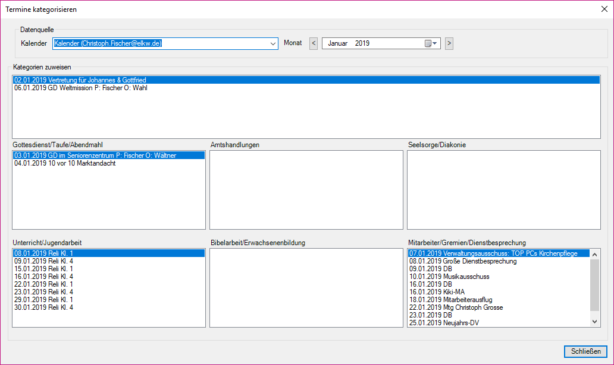
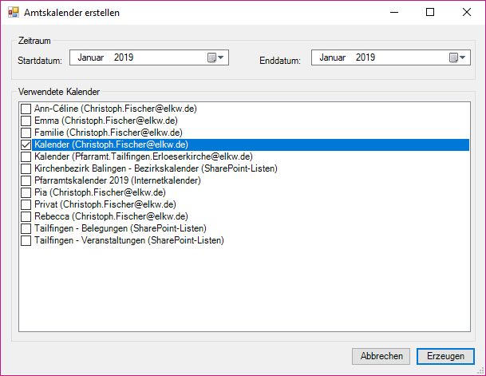
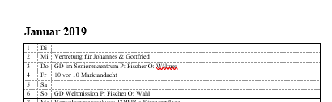
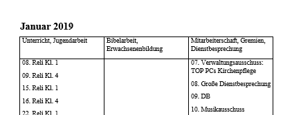

AMTSKALENDER
============

Outlook-Addin zum Erstellen von Monatsübersichten im Amtskalender der Evangelischen Landeskirche in Württemberg.

Autor: Pfarrer Christoph Fischer, christoph.fischer@elkw.de.
Lizenz: GNU General Public License (GPL), Version 3.0 oder höher (siehe [LICENSE](LICENSE))

# Beschreibung
Dieses Addin fügt zu Microsoft Outlook zwei neue Toolbareinträge hinzu. Mit diesen lassen sich 
Kalendereinträge Kategorien zuordnen, die den Dienstbereichen im Amtskalender der ELKW entsprechen. 
Außerdem lassen sich Termine beliebiger Kalender und Monate in ein Word-Dokument exportieren, das den
monatlichen Übersichten im Amtskalender entspricht.

Die Grundidee, ist, dass ein Pfarrer alle relevanten Termine in seinen eigenen Sharepointkalender überträgt
und sie, sofern es passt, einem der sechs Dienstbereiche zuordnet. In diesem Fall kann der komplett 
ausgefüllte Amtskalender für einen Monat anschließend einfach exportiert werden.

# Voraussetzungen
- Microsoft Office 2016 oder höher mit Word und Outlook
- .NET Runtime 4.6.1. oder höher

Die auf den Dienstrechnern der Evangelischen Landeskirche in Württemberg ("PC im Pfarramt") 
vorinstallierte Software sollte im Allgemeinen als Voraussetzung ausreichen.

# Installation
TBD

Im Moment gibt es noch keinen funktionsfähigen Installer. Die 
Verwendung des Addins ist daher nur mit einer Installation von
Microsoft Visual Studio möglich.

# Verwendung

## Termine kategorisieren
Bei der ersten Verwendung des Addins werden automatisch folgende
Kategorien für Kalendereinträge erzeugt:

- Amtskalender: Gottesdienst/Taufe/Abendmahl
- Amtskalender: Amtshandlungen
- Amtskalender: Seelsorge/Diakonie
- Amtskalender: Mitarbeiterschaft/Gremien/Dienstbesprechung
- Amtskalender: Bibelarbeit/Erwachsenenbildung
- Amtskalender: Unterricht/Jugendarbeit

Diese können nun wie gewohnt manuell oder über den 
Toolbareintrag "Kategorisieren" im neuen Reiter "Kirchentools" 
zugewiesen werden. Beim Klick auf diesen Eintrag öffnet sich 
folgendes Fenster:

Nach der Auswahl eines Kalenders und eines Monats im oberen Bereich
des Fensters werden im mittleren Bereich alle noch unkategorisierten
Termine angezeigt, in den Feldern des unteren Bereichs die bereits
einer Kategorie zugeordneten Termine. Einzelne Termine lassen sich
mit der Maus zwischen den Bereichen verschieben und erhalten dabei
automatisch die jeweilige Kategorie zugewiesen.

Ein Doppelklick auf einen Termin öffnet diesen zur Bearbeitung.

Ein Klick auf "Schließen" beendet die Kategorisierung und schließt
das Fenster.

*_Hinweis:_ Die Kategorisierung ist der einzige Bereich des Addins, der 
vorhandene Kalenderdaten verändert (d.h. Kategorien zuweist oder
löscht).*

## Amtskalender erstellen

Ein Klick auf "Erstellen" im Bereich "Amtskalender" des neuen 
Toolbarreiters "Kirchentools" öffnet das Fenster "Amtskalender erstellen":

Im oberen Bereich dieses Fensters kann der zu erstellende
Zeitraum ausgewählt werden. Dabei werden nur ganze Monate berücksichtigt.

Im unteren Bereich des Fensters können die zu verwendenden
Outlook-Kalender gewählt werden. 

Ein Klick auf "Erstellen" öffnet ein neues Microsoft-Word-Dokument,
das mit den gewählten Daten gefüllt wird.

### Inhalte des erstellten Dokuments

Dabei wird der erzeugte Amtskalender wie folgt befüllt:

*Alle* Termine der gewählten Kalender, die in den gewählten Zeitraum  fallen, werden in der Monatsübersicht eingetragen. 

Termine, die eine der sechs Amtskalender-Kategorien haben, werden zusätzlich in der Spalte für den entsprechenden Dienstbereich aufgeführt.

## Automatische Kategorisierung
Die automatische Kategorisierung anhang festgelegter Regeln
ist noch nicht implementiert.

# Bekannte Probleme

## Doppelte Kategoriezuweisung
Bei einer manuellen Kategorisierung ist es möglich, einen Termin
mehreren Amtskalender-Kategorien zuzuweisen. Bei der Erstellung des
Amtskalenders werden die Kategorien in folgender Reihenfolge 
überprüft: 

1. Amtskalender: Gottesdienst/Taufe/Abendmahl
1. Amtskalender: Amtshandlungen
1. Amtskalender: Seelsorge/Diakonie
1. Amtskalender: Mitarbeiterschaft/Gremien/Dienstbesprechung
1. Amtskalender: Bibelarbeit/Erwachsenenbildung
1. Amtskalender: Unterricht/Jugendarbeit

Der Termin taucht dann nur in der Spalte des ersten ihm zugewiesenen
Dienstbereichs auf.

## Entwicklung
Das Amtskalender-Addin wird nach Bedarf weiterentwickelt. Vorschläge
für weitere Funktionen können gerne auf GitHub als "Issue" hinterlegt
werden.

Das Addin befindet sich im Entwicklungszustand und wird vom
Benutzer auf eigene Gefahr verwendet. 

### Aktuelle Roadmap
- [ ] Automatische Kategorisierung nach Regeln
- [ ] Setup-Programm zur eigenständigen Installation ohne Microsoft Visual Studio